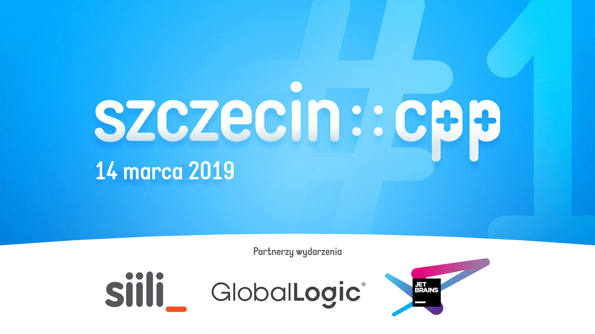

## szczecin::cpp #1

Prezentacje:
* Michał Kucharski: **Go, Go Power Ranges** ([PDF](01-go-go-power-ranges.pdf))
* Jacek Nijaki: **Say Hello to C++ Coroutines** ([PDF](02-say-hello-to-cpp-coroutines.pdf))

Partnerzy wydarzenia:
* [Siili Solutions](https://www.siili.com)
* [GlobalLogic](https://www.globallogic.com)
* [JetBrains](https://www.jetbrains.com)
